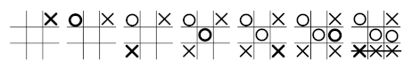

# Tres en raya

El tres en línea, también conocido como ceros y cruces, tres en raya
(España, México, Ecuador y Bolivia), cerito cruz (en Cuba), michi (en Perú),
triqui (en Colombia), cuadritos, juego del gato, gato (en Chile, Costa Rica
y México), ta te tí (en Argentina, Paraguay y Uruguay), totito (en Guatemala),
triqui traka, equis cero (en Honduras), la vieja (en Venezuela) o cero mata
cero (República Dominicana) es un juego de lápiz y papel entre dos jugadores:
O y X, que marcan los espacios de un tablero de 3×3 alternadamente.



Los jugadores no tardan en descubrir que el juego perfecto termina en empate
sin importar con qué juega el primer jugador. Normalmente son los niños
pequeños los que juegan al tres en raya: cuando ya han descubierto una
estrategia imbatible se pasan a juegos más sofisticados.

## Reglas

Cada jugador solo debe colocar su símbolo una vez por turno y no debe ser
sobre una casilla ya jugada. En caso de que el jugador haga trampa el ganador
será el otro. Se debe conseguir realizar una línea recta o diagonal por símbolo.

## Antes de empezar

Necesitas disponer de una versión de Python para poder jugar a esta versión
electrónica. Además, necesitarás tener instalado pygame.

1. Crea un entorno virtual y actívalo

```bash
# Windows
python -m venv env
.\env\Scripts\activate

# Mac/Linux
python3 -m venv env
source ./env/bin/activate
```

2. Instala las dependencias

```bash
pip install -r requeriments.txt
```

3. Arranca el juego

```bash
python play.py
```

## Cómo jugar

El juego marca los turnos de forma alternativa entre ambos jugadores.
Utiliza los número 1-9 para elegir en qué casilla quieres poner tu marca
o haz clic con el botón izquierdo del ratón en la casilla.

Puedes reiniciar la partida pulsando la tecla R.

Si quieres abortar la partida en curso y salir del juego puedes hacerlo
pulsando la tecla ESC o, simplemente, cerrando la ventana.
